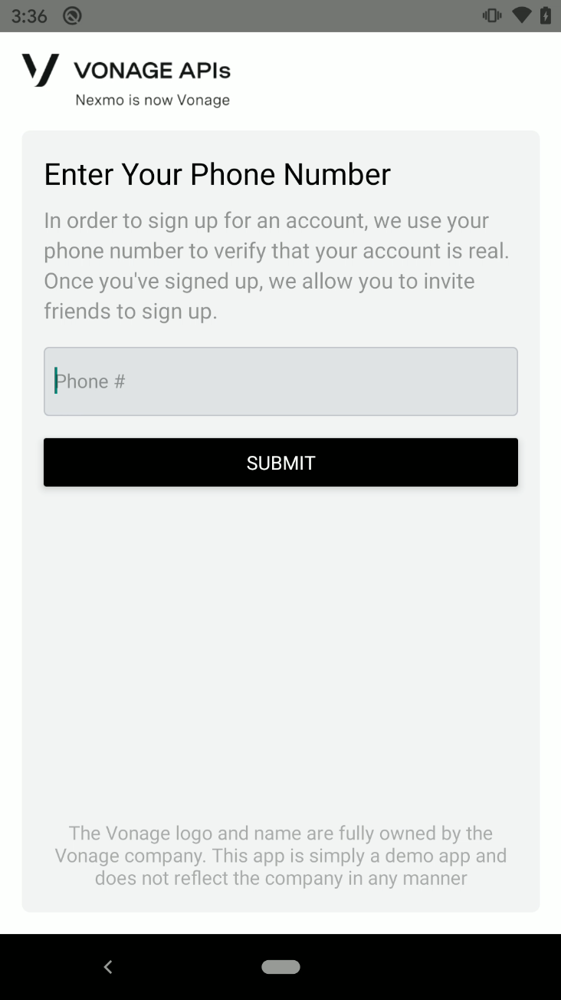
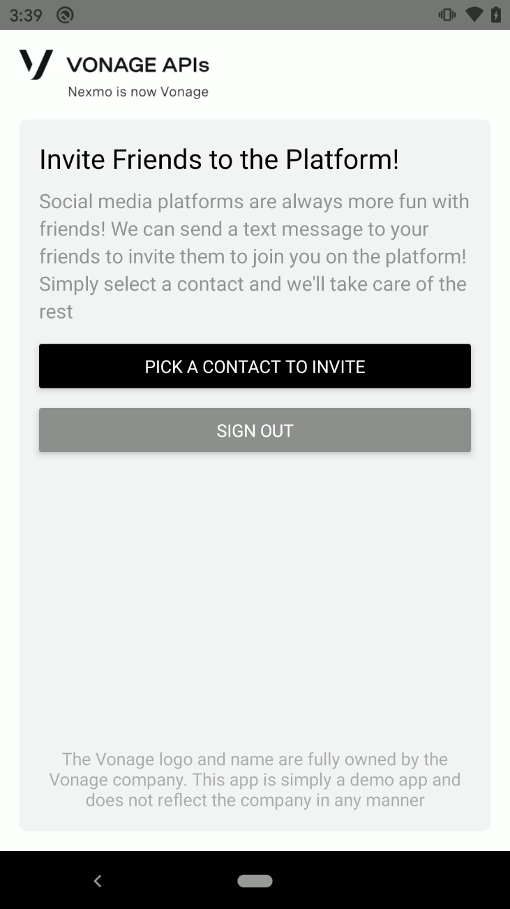

This project is a demo application written in React Native that communicates with an ExpressJS Node backend. It talks to [Vonage APIs](https://www.vonage.com/) in order to send text messages as a form of "account verification". The codebase does not actually contain any kind of auth to prevent further calls and there is no rate limiting on the server, so this code should not be used verbatim in production applications. As such, I have not deployed a server with the Express app or built an APK for general usage.

# Testing the App

## Pre-requisites

- [Have Android Studio installed](https://developer.android.com/studio)
- [Have Node 10+ installed](https://nodejs.org/en/download/)
- [Have React Native configured properly](https://reactnative.dev/docs/getting-started)
- [Have `yarn` installed](https://yarnpkg.com/getting-started/install)
- [Install `ngrok` globally](https://www.npmjs.com/package/ngrok)

## Setup

First, start by cloning the repo:

```
git clone https://github.com/crutchcorn/vonage-phone-verify-notificaitons-app.git
```

Once the project is cloned, run `yarn` to install dependencies for both React Native and the Express server at once:

```
cd vonage-phone-verify-notificaitons-app
yarn install
```

You'll then need to configure the Vonage API keys.

First, go to `/express` and copy the `.env.bak` file into a `.env` file. We'll fill data from your Vonage account here.

Second, make sure you have a Vonage account. You can [creating a Vonage account for free to get started](https://dashboard.nexmo.com/sign-in). 

Once done, take note of your API key and API secret on the "Getting Started" tab:


Store these values under the `NEXMO_API_KEY` and `NEXMO_API_SECRET` values respectively. Then, find the number that's associated with your Vonage account. Go to "Numbers" > "Your numbers":


And store the number in `NEXMO_NUMBER` on the `.env` file. You'll want to store the country code and number without any additional symbols, just the numbers.

## Usage

In order to use the app with the server, you'll want to start three terminal instances in the `vonage-phone-verify-notificaitons-app` folder.

The first one should run the following commands to start the server:

```
cd express
yarn develop
```

The second terminal window should start `ngrok` on your machine, to allow the app to connect to it:

```
ngrok http 3000
```

This should bring up a window like this one. Copy the `ngrok.io` link, we'll need it later


Before we start the third and final window to start the debug mode of the React Native app, we'll need to edit some code in `/react-native/src/contants.js`. Simply change the `SERVER_BASE` variable to match a string of the NGROK URL and you should be all set.

Finally, once that is done, and the server and ngrok are running, you can run the final command to start the React Native app loading in Android:

```
cd react-native
yarn android
```

# App Screenshots




